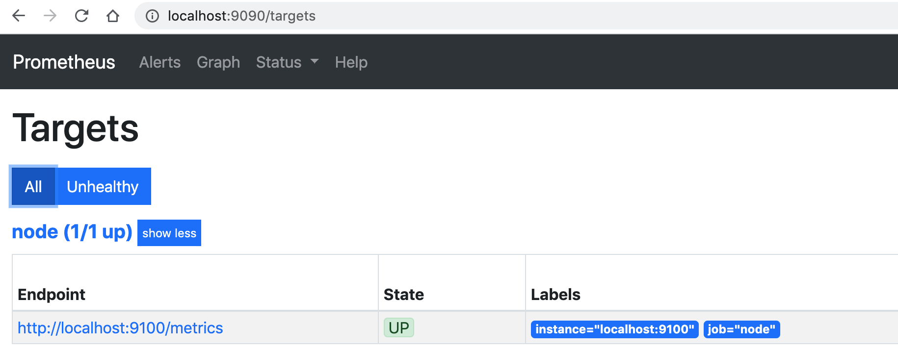
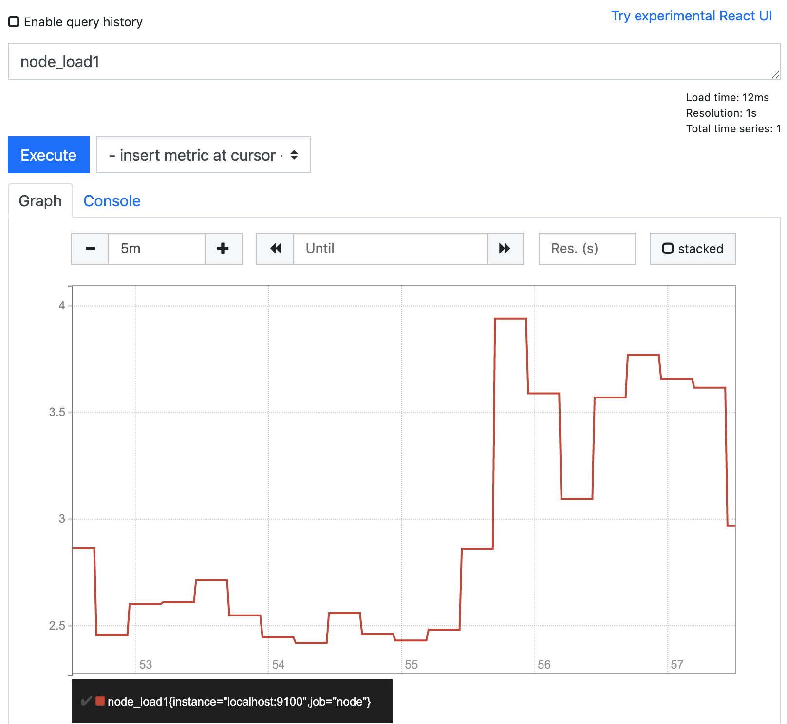

### Job and Instance

Edit `prometheus.yml` file, add node_exporter instance.

```yaml
scrape_configs:
  - job_name: 'node'
    static_configs:
      - targets: ['localhost:9100']
```

Go to http://localhost:9090/targets, to get all the instance and job info that being scraped.



Make a `node_load1` query in Prometheus Expression Browser



### [Prometheus Architecture](https://prometheus.io/docs/introduction/overview/#architecture)

- Prometheus server
    - TSDB
    - PromQL
    - Federation
    - Service Discovery
    
- Exporter
  By exposing HTTP endpoint, exporters expose metrics to Prometheus.
  - Direct Instrumentation
  - Client Library
    
### Alert Manager

- Alerting Rules based on PromQL
- Alerts: email, slack, webhook

### PushGateway

When Prometheus Server cannot connect to expoerter. We need PushGateway to save metrics to Gateway,
and Prometheus Server Pull metrics from Gateway.


