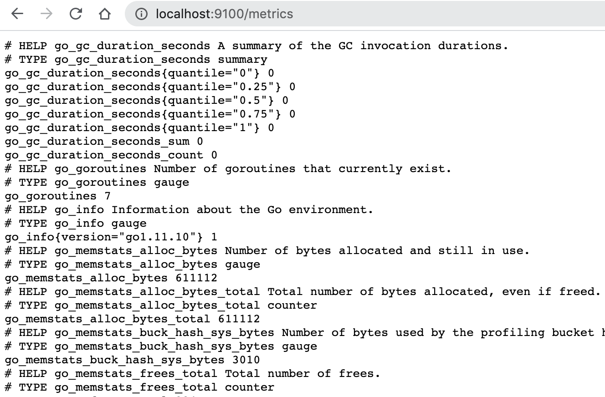

# Use Node Exporter Inspecting machine-level metrics

## Download and install Node Exporter

https://prometheus.io/download/

## Start Node Exporter and Check the metrics

Run the binary:
```
$ ./node_exporter
```

```bash
INFO[0000] Enabled collectors:                           source="node_exporter.go:97"
INFO[0000]  - boottime                                   source="node_exporter.go:104"
INFO[0000]  - cpu                                        source="node_exporter.go:104"
INFO[0000]  - diskstats                                  source="node_exporter.go:104"
INFO[0000]  - filesystem                                 source="node_exporter.go:104"
INFO[0000]  - loadavg                                    source="node_exporter.go:104"
INFO[0000]  - meminfo                                    source="node_exporter.go:104"
INFO[0000]  - netdev                                     source="node_exporter.go:104"
INFO[0000]  - textfile                                   source="node_exporter.go:104"
INFO[0000]  - time                                       source="node_exporter.go:104"
INFO[0000] Listening on :9100                            source="node_exporter.go:170"
```
Go to: http://localhost:9100/metrics




